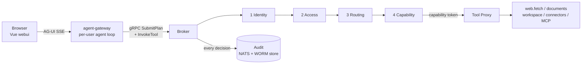

<p align="center">
  
</p>

<h3 align="center">
  <picture>
    <source media="(prefers-color-scheme: dark)" srcset="docs/img/eu-mark-dark.png" />
    
  </picture>
  &nbsp;AI control OS for enterprises
</h3>

<p align="center">
  <a href="LICENSE"></a>
  
  
</p>

---

Aikonos is a self-hosted control plane for AI agents. An agent proposes what it
wants to do, and Aikonos decides whether it may, one action at a time, against
policy you write. Every decision lands in a tamper-evident audit trail.

You bring the model. Aikonos governs what it can touch.

| Who | What they get |
|-----|---------------|
| Users | An agent workspace: chat, files, connectors, approved tool servers, scheduled runs, and handing a task to a colleague's agent |
| Security | One control plane for who may do what, which hosts agents may reach, and which actions need a human |
| Compliance | A signed, hash-chained record of every decision with its policy rule, approver and context |
| Finance | Per-user and per-task spend caps, so a looping agent cannot become a surprise invoice |

**On prompt injection.** Aikonos does not claim to prevent it. Nobody has
solved that. Aikonos contains it: a compromised agent can only do what policy
already allows, every action is scoped to a single-use capability token, and the
whole path is recorded. The blast radius is bounded by design rather than by the
model behaving.

---

## Quick start

Four commands to a running, policy-enforcing stack with a web console.

**You need:** Docker Engine 24+ with Compose v2, [Task](https://taskfile.dev),
about 8 GB of free RAM, and an API key for any OpenAI-compatible LLM provider
(OpenRouter by default).

```bash
git clone https://github.com/adamdekan/aikonos.git
cd aikonos

cp deploy/compose/.env.local.example .env    # then set OPENROUTER_API_KEY
task compose:up                              # build + start (first run: 5-10 min)
task compose:seed                            # TLS certs, Vault role, policy data
task compose:verify                          # smoke-test the running stack
```

`compose:verify` prints a pass or fail line per check and ends with a count.
Everything should pass. The one check that commonly fails on a fresh setup is
the chat round-trip, which needs a working LLM provider with credit.

Then open **http://localhost:4200** and sign in. The bundled Keycloak seeds
three accounts, all with the password `dev`:

| Account | What it can do |
|---------|----------------|
| `admin@example.com` | Everything, including the admin console |
| `alice@example.com` | An ordinary member with tool grants and a sample skill |
| `bob@example.com` | A second member, for delegation and inbox flows |

No external identity provider is involved. These are local development
fixtures, seeded only when `AIKONOS_SEED_DEMO_TUPLES=1`, which `compose:seed`
sets. Remove them before any deployment that matters.

### Try it in five minutes

1. Sign in as `admin@example.com`, then open `/admin/providers` and confirm
   your LLM provider is enabled.
2. Start a chat and ask the agent to fetch a web page. The tool call appears in
   the stream, crosses the gates, and returns.
3. Ask it to write a document. That call routes to an isolated document service
   with no network access and no credentials of its own.
4. Open `/admin/audit` to watch decisions arrive live, then
   `/admin/audit/history` to query them and re-verify the hash chain.
5. Sign out, sign in as `alice@example.com`, and open `/admin/providers`. It
   refuses, because the access gate denies it.

### If something looks wrong

| Symptom | Cause |
|---------|-------|
| `broker` restarting in a loop before `compose:seed` | Expected. The env template sets Vault to AppRole auth with no credentials yet, and `compose:seed` mints them. |
| Chat returns nothing | The LLM provider rejected the call. Check `docker compose logs agent-gateway` for the provider's error, usually a missing key or no credit. |
| `compose:verify` skips OIDC checks | It found no identity provider. Confirm `.env` came from `.env.local.example`. |
| Everything denied after seeding | `AIKONOS_BROKER_TENANT_ID` in `.env` must match the tenant in `policies/fga/tuples/dev-seed.yaml`. |

To stop the stack, run `docker compose down`. Add `-v` to delete its data too.

---

## How it works

An agent never acts on its own. It asks the broker, and the broker decides.

Every tool call crosses four independent gates before anything executes:



The gates run in order and each one can stop the call. They are independent, so
defeating one buys nothing if the next denies.

| # | Gate | Mechanism | Answers | If it fails |
|---|------|-----------|---------|-------------|
| 1 | Identity | OIDC bearer, SPIFFE mTLS | Who is calling, for which tenant | Reject |
| 2 | Access | OpenFGA ReBAC, checked per call | May this principal use this tool | Deny |
| 3 | Routing | OPA ABAC by effect class | Auto, human approval, step-up, or deny | Deny |
| 4 | Capability | Biscuit token, one per approved step | What scope this single call may exercise | Deny |

Two properties do the real work. Policy decides *how* a step is gated but never
*whether* a principal is allowed, so a misdeclared tool cannot dodge approval.
And a capability token can only be narrowed, never widened, so delegating a task
to a colleague can only shrink what their agent may do.

High-risk steps pause at gate 3 and stream an approval card to the browser.
Approvals are n-of-m with separation of duty: configuration can raise the
approver bar but never lower it, and a requester cannot approve their own task.

For the full model, see [`docs/02-policy-model.md`](docs/02-policy-model.md).

---

## What you get

| Area | Included |
|------|----------|
| Agent workspace | Governed chat with streaming, persistent sessions that rehydrate full context, per-user file explorer, named agents with their own toolsets and models |
| Delegation | Hand a scope-narrowed task to a colleague; they accept from an inbox and their agent runs it |
| Skills | Admin-governed skill bundles plus per-user personal skills in [Agent Skills](https://agentskills.io) format, with an injection scan on transfer |
| Agent memory | Durable per-user, per-group and per-agent knowledge, auto-recalled by keyword and injected as data rather than instructions |
| Scheduling | One-off and cron runs, fired as their owner, with pre-authorized tool allowlists standing in for human consent |
| Tools and connectors | Web fetch with a host allowlist, an isolated document service, Google Drive and OneDrive (each needs your own OAuth app), and any MCP server an admin approves |
| Governance | Per-call access checks, human-in-the-loop approvals, network allowlists, spend caps, rate limits, kill switches |
| Audit | Hash-chained signed events to a WORM object store, queryable and verifiable in the console, streamed live over SSE |
| Isolation | Provider credentials never enter the agent loop; each user's agent runs in its own process |

The [documentation site](docs-site/) ships with the stack and answers at
`/docs` on a running instance.

---

## Where things live

| Path | Contents |
|------|----------|
| `broker/` | Go orchestration core: task state machine, the four gates, Tool Proxy, audit |
| `agent-gateway/` | Node agent harness, AG-UI streaming, scheduler, external agent API |
| `webui/` | Vue 3 console: chat, files, connectors, schedules, inbox, admin, audit |
| `policies/` | OPA Rego routing rules, OpenFGA model and tuples |
| `office-worker/` | Document service with no egress and no credentials |
| `proto/` | Protobuf contracts, the gRPC API surface |
| `compose.yaml` | The stack, with `core` and `obs` profiles |
| `deploy/compose/` | Operator guide, env templates, Keycloak realm, migrations |
| `scripts/` | Lifecycle and verification scripts |
| `docs/` | Architecture, policy model, threat model, runbook |

| Component | Built with |
|-----------|-----------|
| broker | Go 1.23, Postgres with row-level security, NATS, Vault, MinIO |
| agent-gateway | Node 22, TypeScript |
| webui | Vue 3, Vite, Fastify |
| Decisions | OpenFGA for access, OPA for routing, Biscuit for capabilities |
| Identity | Keycloak by default; any OIDC provider works |

---

## Maturity

Aikonos is pre-1.0 and deploys with Docker Compose only. The governed substrate
runs with enforcement on, and the paths below are verified end to end against a
running stack rather than only unit-tested.

| Verified against a running stack | Not yet demonstrated |
|----------------------------------|----------------------|
| Four-gate enforcement on every tool call | Kubernetes deployment |
| Audit chain signing, querying and re-verification | Connectors against real provider OAuth apps |
| Tool execution through the gates to the document service | Alert delivery to webhook or SMTP |
| Agent isolation and credential separation | n-of-m approvals with production approver data |
| Skill bundle grants, and denial for a non-admin | Independent security audit |
| External agent API keys, mint through revoke | |

Admin RPCs assume one tenant per broker. Three zero-trust findings are open by
decision rather than oversight, each documented with its reasoning in
[SECURITY.md](SECURITY.md), so you can weigh them against your own threat model.

---

## Documentation

| Doc | Purpose |
|-----|---------|
| [`docs/00-aikonos-architecture.md`](docs/00-aikonos-architecture.md) | Architecture reference |
| [`docs/02-policy-model.md`](docs/02-policy-model.md) | Access, routing and capability model |
| [`docs/04-threat-model.md`](docs/04-threat-model.md) | Threat model |
| [`docs/10-enable-enforcement.md`](docs/10-enable-enforcement.md) | Turning enforcement on and validating it |
| [`docs/OPS-RUNBOOK.md`](docs/OPS-RUNBOOK.md) | Startup, operations, incident response |
| [`deploy/compose/README.md`](deploy/compose/README.md) | Operator guide: profiles, volumes, backup, recovery |
| [`SECURITY.md`](SECURITY.md) | Reporting a vulnerability, scope, known limitations |
| [`ROADMAP.md`](ROADMAP.md) | Architectural invariants and open work |

---

## Contributing

Issues and pull requests are welcome. Run what CI runs before opening one:

```bash
task broker:test     # Go unit tests
task policy:test     # OPA policy tests
task test:all        # gateway, webui and docs-mcp suites
task compose:verify  # smoke-test a running stack
```

[CONTRIBUTING.md](CONTRIBUTING.md) covers sign-off, the two conventions a
reviewer will hold you to, and where to start.
[CODE_OF_CONDUCT.md](CODE_OF_CONDUCT.md) governs participation.

Security issues do not belong in the issue tracker. See
[SECURITY.md](SECURITY.md).

---

## License

[Apache License 2.0](LICENSE). See [NOTICE](NOTICE) for attribution and
third-party terms.
